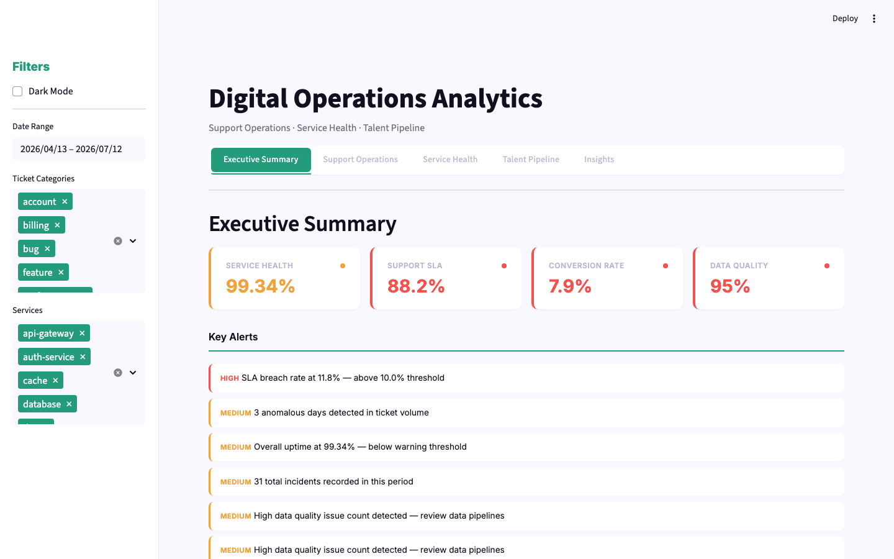

# Digital Operations Analytics

A multi-source operations analytics dashboard that ingests, cleans, analyzes, and visualizes operational data across three domains — customer support, infrastructure reliability, and talent acquisition.

Built to demonstrate the systems-level thinking, data pipeline design, and analytical communication expected of an **ICT Business Analyst** or **Systems Analyst**.



---

## Problem Statement

Organizations generate operational data across disconnected systems: support tickets in a CRM, infrastructure metrics from monitoring tools, and applicant data from an ATS. Making sense of these fragmented signals — spotting trends, detecting anomalies, and connecting dots across domains — requires a disciplined analytical approach rather than raw technical skill.

This project simulates that exact challenge.

## Approach

### Data Ingestion

Three synthetic generators produce realistic operational data with deliberately injected quality issues:

| Source | Volume | Data Quality Issues Injected |
|--------|--------|------------------------------|
| **Support Tickets** | ~900 records (90 days) | Missing CSAT, negative resolution times, category typos, duplicate IDs, future timestamps |
| **Service Health** | ~23,000 checks (30 days, 8 services) | Out-of-order timestamps, missing response times, duplicate entries, negative values |
| **Job Applications** | ~200 records (60 days) | Impossible stage transitions, missing IDs, future timestamps, unknown sources |

Cross-source correlation is baked in: when infrastructure services experience incidents, the probability of related support ticket categories increases within 24–48 hours.

### Data Processing & Quality

Each data source passes through a cleaning pipeline that:
- Detects and quantifies data quality issues
- Fixes or flags invalid values (imputation, coercion, removal)
- Standardizes inconsistent formats (category names, timestamps)
- Produces a data quality report shown in the dashboard

### KPI Framework

| Domain | KPIs |
|--------|------|
| **Support Operations** | Ticket volume & trend, avg/median/P95 resolution time, SLA breach rate, CSAT score & trend, category distribution, volume anomalies (z-score) |
| **Service Reliability** | Uptime %, degraded %, incident count, MTTR, avg/P95 response time, per-service breakdown, response time trend |
| **Talent Pipeline** | Total applications, conversion rate, funnel stage breakdown, time-to-hire, source effectiveness, role distribution |

### Analytics Techniques

- **Statistical anomaly detection** using z-score thresholding on daily ticket volume and response time series
- **Week-over-week trending** for volume, resolution time, CSAT, and response time
- **Cross-source correlation** measuring Pearson's r between infrastructure incidents and support ticket volume
- **RAG (Red-Amber-Green) health scoring** for executive-level status communication

## Architecture

```
digital-operations-analytics/
├── config.yaml                        # All tunable parameters
├── data/
│   ├── generators/
│   │   ├── tickets.py                 # Support ticket synthetic data
│   │   ├── services.py                # Homelab service health checks
│   │   └── applications.py            # Job application pipeline
│   └── generate_all.py                # Orchestrator (services first, then tickets with incident correlation)
├── analytics/
│   ├── metrics.py                     # Shared: anomaly detection, WoW change, RAG scoring
│   ├── ticket_metrics.py             # Ticket KPIs + cleaning
│   ├── service_metrics.py            # Service KPIs + cleaning
│   └── application_metrics.py        # Application KPIs + cleaning
├── dashboard/
│   └── app.py                         # Streamlit dashboard (5 tabs)
├── tests/
│   ├── test_data_quality.py          # Generator + cleaning tests
│   └── test_metrics.py               # KPI + analytics tests
├── requirements.txt
└── Makefile
```

**Design decisions:**
- **Services generated first** so incident timestamps can drive ticket category spikes — enabling realistic cross-source correlation analysis
- **Data quality injected at generation time** rather than post-hoc — simulates real ingestion from unreliable sources
- **Cleaning separate from generation** — the dashboard shows raw data quality vs. cleaned metrics side by side
- **Config-driven** — all rates, thresholds, and parameters in `config.yaml` — no magic numbers in code

## Dashboard

Five tabs accessible from a single Streamlit application:

| Tab | Content |
|-----|---------|
| **Executive Summary** | RAG health cards (Service Health, Support SLA, Conversion Rate, Data Quality), key alerts, trend sparklines |
| **Support Operations** | Daily volume with anomaly markers, category breakdown, resolution time trend with SLA threshold, SLA compliance by category |
| **Service Health** | Per-service uptime with warning/critical lines, response time trend, incident timeline, uptime vs. response scatter |
| **Talent Pipeline** | Application funnel, source breakdown with conversion rates, stage distribution, role breakdown |
| **Insights** | Data quality issue breakdown per source, anomaly detection results, cross-source correlation chart (incidents vs. ticket volume with Pearson's r), per-service correlation, automated insight text |

### Filters

Sidebar controls: date range, ticket category multi-select, service multi-select — all charts respond to filter changes.

## Skills Demonstrated

| Skill | Evidence |
|-------|----------|
| **Data ingestion from multiple sources** | Three distinct generators with different schemas and quality profiles |
| **Data quality management** | Detection, quantification, and remediation of 12+ issue types across all sources |
| **KPI definition & tracking** | 20+ operational metrics across 3 domains with trend and anomaly analysis |
| **Cross-source correlation** | Statistical linking of infrastructure incidents to support ticket volume |
| **Statistical analysis** | Z-score anomaly detection, Pearson correlation, moving averages |
| **Dashboard design** | Streamlit with Plotly, responsive layout, RAG status, executive summary |
| **Stakeholder communication** | Executive summary tab, auto-generated insight text, data quality reporting |
| **Software engineering** | Config-driven design, separation of concerns, 48 passing tests |
| **Systems thinking** | Understanding how infrastructure failures propagate to customer-facing support channels |

## Quick Start

```bash
# Install dependencies
make install

# Launch dashboard
make run

# Run tests
make test
```

### Requirements

- Python 3.9+
- See `requirements.txt` for full dependency list

## Key Findings (Sample Run)

> These are auto-generated from randomized data — every run produces different insights.

- Ticket volume averaged 10.4 tickets/day with a −8.5% week-over-week trend
- Most common ticket category: "bug" (30% of all tickets)
- Infrastructure experienced 31 incidents with MTTR averaging 63.5 minutes
- Cross-source correlation: r=0.42 between incidents and support ticket volume
- "linkedin" is the most effective application source (28% of all applications)

## What This Demonstrates for ICT Business Analyst Roles

This project was built specifically to evidence the competencies listed in ICT Business Analyst / Systems Analyst position descriptions:

- **Requirements gathering & process analysis** — The three data sources model real business processes (customer support, IT operations, talent acquisition). Each generator encodes domain-specific rules and edge cases that a BA would need to discover and document.
- **Data-driven decision support** — The dashboard doesn't just show numbers; it highlights anomalies, trends, and correlations that would inform business decisions (e.g., "Should we invest in database resilience or auth-service redundancy?").
- **Stakeholder communication** — The Executive Summary and Insights tabs translate raw metrics into actionable language for non-technical stakeholders.
- **Cross-functional systems thinking** — The incident-to-ticket correlation analysis demonstrates understanding that operational domains are interconnected, not siloed.
